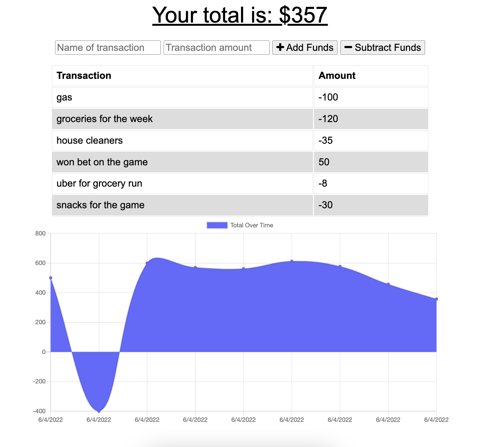

# Budget Tracker 

Progressive web application that allows users to track their spending and saving habits. Users can download the application to be available for offline access. If no internet connection is available, the transactions will be saved locally and when the user reconnects, the transactions will be uploaded to refresh and save the data on the server.

## Technologies Used

- Node.js
- Express.js
- indexedDB
- mongoDB

Here's a screenshot of the app in use: 

And you can find the app deployed live on heroku [here](https://frozen-anchorage-05231.herokuapp.com/)